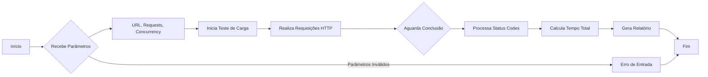

# goLoadRep
Experimento de sistema CLI em Go para realizar testes de carga em um serviço web

**goLoadRep** é uma ferramenta CLI em Go projetada para realizar testes de carga em serviços web. O objetivo é enviar múltiplas requisições HTTP a uma URL especificada e gerar um relatório detalhado com informações sobre o desempenho do serviço.

## Funcionalidades

- Realiza testes de carga simulando múltiplas requisições simultâneas.
- Gera um relatório contendo:
  - Tempo total de execução.
  - Total de requisições realizadas.
  - Quantidade de requisições com status HTTP 200.
  - Distribuição de outros códigos de status HTTP (404, 500, etc.).

## Instalação

### 1. Clonar o repositório

```bash
git clone https://github.com/usuario/goLoadRep.git
cd goLoadRep
```

### 2. Instalar dependências

```bash
go mod tidy
```

### 3. Compilar o projeto

```bash
go build -o goLoadRep
```

### 4. Rodar o aplicativo

A ferramenta pode ser executada diretamente via CLI com os parâmetros necessários:

```bash
./goLoadRep --url=http://exemplo.com --requests=1000 --concurrency=10
```

### Parâmetros

- `--url`: URL do serviço a ser testado.
- `--requests`: Número total de requisições a serem enviadas.
- `--concurrency`: Número de requisições simultâneas.

### Exemplo de Uso com Docker

Você pode também rodar a ferramenta através de um container Docker:

```bash
docker build -t goLoadRep .
docker run goLoadRep --url=http://exemplo.com --requests=1000 --concurrency=10
```

## Fluxo de Execução

O diagrama a seguir ilustra o fluxo de execução do teste de carga:



### Explicação do Diagrama:

1. **Recebe Parâmetros**: O sistema começa recebendo os parâmetros da linha de comando, incluindo a URL, o número total de requisições e o número de requisições simultâneas.
2. **Inicia Teste de Carga**: Com os parâmetros fornecidos, o teste de carga é iniciado.
3. **Realiza Requisições HTTP**: O sistema envia as requisições simultâneas para o serviço web especificado.
4. **Aguarda Conclusão**: O processo aguarda todas as requisições terminarem, respeitando o limite de concorrência.
5. **Processa Status Codes**: O sistema processa os status codes HTTP das respostas.
6. **Calcula Tempo Total**: O tempo total gasto para concluir o teste de carga é calculado.
7. **Gera Relatório**: Um relatório com os resultados do teste é gerado.
8. **Fim**: O processo é concluído.

## Licença

Este projeto está licenciado sob a MIT License - veja o arquivo [LICENSE](LICENSE) para mais detalhes.
